# DeepSeek: Innovations From Scratch

**A self-directed study into how DeepSeek built a frontier large language model at a fraction of the conventional cost — by rethinking architecture, training, and systems from the ground up.**

---

## Overview

This repository is a structured learning project that reverse-engineers the core technical decisions behind DeepSeek's model series. Rather than simply reading papers, each concept is implemented from scratch in PyTorch, annotated with diagrams, and verified against published results.

The central thesis of this study: DeepSeek did not invent entirely new mathematics — it combined and refined existing techniques in ways that compounded into substantial cost and performance gains. Understanding each innovation in isolation, and then understanding how they interact, is the goal of this repository.

---

## Learning Journey

The study is organized into four sequential phases, each building on the last.

```
Phase 1               Phase 2               Phase 3               Phase 4
Innovative            Training              GPU Optimization       Model
Architecture          Methodology           Tricks                 Ecosystem
─────────────         ─────────────         ─────────────         ─────────────
MLA                   Reinforcement         NVIDIA Parallel        Model
MoE                   Learning (RL)         Thread Execution       Distillation
MTP                   Rule-based            PTX (not CUDA)         (down to 1.5B
Quantization          Reward System                                parameters)
RoPE
```

---

## Repository Structure

```
deepseek/
│
├── Multihead latent attention.ipynb     # Phase 1 — MLA implementation
├── MoE.ipynb                            # Phase 1 — Mixture of Experts
├── deepseek_MoE.ipynb                   # Phase 1 — DeepSeek-specific MoE routing
├── Multi-Token-prediction.ipynb         # Phase 1 — MTP implementation
├── ROPE_MLA.ipynb                       # Phase 1 — RoPE + MLA combined
├── multi_headAttention.ipynb            # Phase 1 — Standard MHA baseline
│
├── deepseek Quantization technique/     # Phase 1 — Quantization documentation
│   ├── 01_floating_point_formats.svg
│   ├── 02_mixed_precision_framework.svg
│   ├── 03_fine_grained_quantization.svg
│   ├── 04_accumulation_precision.svg
│   ├── 05_mantissa_over_exponents.svg
│   └── 06_online_vs_offline_quantization.svg
│
├── assets/                              # Architecture diagrams
│   ├── MLA_RoPE_animated.svg
│   ├── moe_architecture_animated.svg
│   ├── mtp_flow_animated.svg
│   ├── MLA_RoPE.png
│   ├── MoE_enhanced.png
│   └── mtp_architecture.png
│
└── requirements.txt
```

---

## Phase 1: Innovative Architecture

DeepSeek's architectural choices reduce memory, compute, and parameter count while maintaining or exceeding the quality of larger conventional models.

### Multi-Head Latent Attention (MLA)

Standard Multi-Head Attention (MHA) stores one Key-Value (KV) cache entry per token per layer — a major memory bottleneck at inference time. MLA compresses the KV cache into a low-rank latent vector using a learned down-projection, reducing the inference-time memory footprint by 5–13× compared to MHA.

The KV joint compression takes the form:

```
c_KV = W_DKV · h_t          (down-projection, shared)
k_C  = W_UK · c_KV          (key up-projection)
v_C  = W_UV · c_KV          (value up-projection)
```

Only `c_KV` needs to be cached — not the full K and V matrices.

**Reference implementation:** `Multihead latent attention.ipynb`, `ROPE_MLA.ipynb`

**Architecture diagram:**


---

### Mixture of Experts (MoE)

Instead of activating all model parameters for every token, MoE routes each token through a small subset of specialized "expert" feed-forward networks. DeepSeek uses a fine-grained expert segmentation with:

- **Shared experts:** Always activated, handle universal linguistic patterns
- **Routed experts:** Activated selectively per token by a learned router
- **Load balancing loss:** Prevents routing collapse (all tokens sent to one expert)
- **Token dropping:** Capacity limits enforce even expert utilization

This allows a model with 671B total parameters to activate only ~37B per token (DeepSeek-V3), dramatically reducing compute while retaining capacity.

**Reference implementation:** `MoE.ipynb`, `deepseek_MoE.ipynb`

**Architecture diagram:**



---

### Multi-Token Prediction (MTP)

Standard language models predict one token per forward pass. DeepSeek adds sequential MTP modules that predict multiple future tokens in a single pass, using the hidden states of previous predictions as context.

Benefits:
- Improves training signal density (more useful gradient per pass)
- Enables speculative decoding at inference time (generate draft tokens, verify in parallel)
- Reported to accelerate inference throughput by approximately 1.8× in DeepSeek-V3

**Reference implementation:** `Multi-Token-prediction.ipynb`

**Architecture diagram:**



---

### Rotary Positional Encodings (RoPE)

RoPE encodes position by rotating query and key vectors in frequency space rather than adding positional embeddings. This gives:

- Relative position awareness by construction (dot products naturally decay with distance)
- Extrapolation beyond the training context length
- Clean integration with MLA's compressed KV representations

In DeepSeek-V3, RoPE is applied to a decoupled positional key head, keeping it separate from the compressed semantic keys — preserving the compression ratio of MLA.

**Reference implementation:** `ROPE_MLA.ipynb`

---

### FP8 Quantization (Pre-Training)

DeepSeek trains in FP8 precision — an 8-bit floating-point format — achieving approximately 2× GEMM throughput versus BF16 while maintaining model quality. This is the focus of the dedicated documentation below.

---

## Quantization Documentation

The `deepseek Quantization technique/` folder contains six standalone SVG documents, each covering one innovation in detail. These are intended as reference material and a record of the study process.

### Document 1: Floating Point Formats and Foundation

Covers the IEEE-754 standard, bit layouts for FP32, FP16, BF16, FP8 (E4M3 and E5M2), and the precision-range tradeoff that motivates every subsequent design decision.


---

### Document 2: Mixed Precision Framework

Documents the forward pass (`y = Wx`), the Dgrad backward pass (`∂L/∂x`), and the Wgrad backward pass (`∂L/∂W`). Shows which operations use FP8, BF16, and FP32, and explains why weight updates must remain in FP32 to capture small gradient steps.


---

### Document 3: Fine-Grained Quantization

Explains the outlier problem in standard per-tensor quantization and DeepSeek's group-based solution: independent scale factors per `1×128` activation slice and per `128×128` weight tile. Includes a worked numerical example showing 195× more effective precision for non-outlier groups.


---

### Document 4: Increasing Accumulation Precision

Covers catastrophic cancellation in low-precision dot products and how DeepSeek uses FP32 accumulators within NVIDIA Hopper's WGMMA (Warpgroup Matrix Multiply Accumulate) instruction to sum FP8 products without precision loss — at zero additional hardware cost.


---

### Document 5: Mantissa over Exponents — Why E4M3?

Explains the choice of E4M3 (4-bit exponent, 3-bit mantissa) over E5M2 for both weights and activations. Because fine-grained group scaling (Document 3) already manages dynamic range, the extra mantissa bit in E4M3 provides higher value distinction — the correct tradeoff for training quality.


---

### Document 6: Online vs. Offline Quantization

Distinguishes between offline (calibration-based, fixed scale) and online (per-batch, dynamic scale) quantization. Documents DeepSeek's training strategy (fully online), the risks of offline scaling during training, and the hybrid inference strategy (offline weight scales + online activation scales).


---

## Mathematical Intuition Notes

Before any code was written, each concept in this repository was first worked through by hand — deriving the mathematics from first principles, tracing through dimensions, and building intuition for why each design decision is necessary.

The full collection of handwritten derivations is compiled in:

**[`assets/mathematical_intution_notes/deepseek from scratch.pdf`](assets/mathematical_intution_notes/deepseek%20from%20scratch.pdf)**

The notes cover the following topics, in study order:

| Topic | Key Questions Addressed |
|---|---|
| Attention mechanism (scaled dot-product) | Why divide by sqrt(d_k)? What does the softmax actually compress? |
| Multi-Head Attention | Why multiple heads? What does each head specialize in? |
| Multi-Head Latent Attention (MLA) | How does low-rank KV projection preserve attention quality? What is the rank-precision tradeoff? |
| KV cache and memory bottleneck | Where does KV cache memory go during inference? How does MLA change the equation? |
| Rotary Positional Encodings (RoPE) | Why does rotating Q and K in frequency space encode relative position? Derivation from scratch. |
| Mixture of Experts routing | What does the router learn? Why does load balancing prevent collapse? |
| Floating point representation | IEEE-754 derivation, why mantissa determines precision, why exponent determines range |
| FP8 quantization errors | How do rounding errors accumulate in dot products? What is catastrophic cancellation? |
| Group scaling mathematics | Why does per-group scaling bound the precision loss from outliers? |
| Gradient flow in mixed precision | Why do small gradient updates vanish in BF16/FP8? How does FP32 master weight storage fix this? |

These notes serve as the conceptual foundation for every implementation in the repository. Reading them alongside the code is the intended approach — the diagrams in `deepseek Quantization technique/` are the visual extension of the same derivations.

---

## Why These Innovations Compound

Each technique in Phase 1 is independent but mutually reinforcing:

| Innovation | Direct Benefit | Enables |
|---|---|---|
| MLA | 5–13× KV cache reduction | Longer context at same memory |
| MoE | Only ~5% of params active per token | 10–100× more params at same compute |
| MTP | Denser training signal | Speculative decoding at inference |
| RoPE | Better positional generalization | Longer context extrapolation |
| FP8 (E4M3) | 2× GEMM speed, 4× memory vs FP32 | Training at scale without proportional cost |
| Fine-grained scaling | Preserves FP8 quality | Makes E4M3 viable where E5M2 would be needed |
| FP32 accumulation | Stable training gradients | FP8 training without quality loss |
| Online quantization | No overflow, adaptive scaling | FP8 training on arbitrary data distributions |

The combined effect is a model that trains at approximately 1/10th the compute cost of comparable proprietary models, as reported in the DeepSeek-V3 technical report.

---

## Phase 2: Training Methodology

*(Study in progress)*

DeepSeek-R1 introduced a training pipeline that moves beyond imitation learning from human-labeled data:

- **Group Relative Policy Optimization (GRPO):** A variant of PPO that eliminates the value model, computing advantage estimates from a group of sampled outputs relative to each other.
- **Rule-based reward system:** Rewards are computed from verifiable outcomes (mathematical correctness, code execution results) rather than a trained reward model — eliminating reward hacking.
- **Cold-start SFT:** A small set of long chain-of-thought examples bootstraps reasoning before RL, preventing mode collapse in early training.

The key insight: large-scale RL on verifiable tasks teaches the model complex reasoning patterns that human labelers cannot efficiently supervise.

---

## Phase 3: GPU Optimization Tricks

*(Study in progress)*

DeepSeek's engineering team optimized at the CUDA/PTX level rather than relying on high-level frameworks:

- **PTX-level parallelism:** Direct PTX assembly for tensor core instructions, bypassing CUDA abstraction overhead
- **NVIDIA Parallel Thread Execution (PTX):** Lower-level than CUDA, allows precise control of warp scheduling and register allocation
- **Pipeline overlapping:** Compute and memory transfers overlapped across pipeline stages
- **FP8 GEMM kernels:** Custom kernels implementing the WGMMA instruction sequences documented in Phase 1

---

## Phase 4: Model Ecosystem

*(Study in progress)*

DeepSeek's distillation pipeline transfers reasoning capability from the large R1 model into much smaller models — down to 1.5B parameters — while retaining a significant fraction of performance on reasoning benchmarks.

This makes frontier-grade reasoning accessible on consumer hardware, which was not previously achievable.

---

## Future Study Plan

The four-phase roadmap below maps this study. This repository will be updated as each phase is completed, with implementations and documentation following the same format established in Phase 1.

| Phase | Focus Area | Status |
|---|---|---|
| Phase 1 | Innovative Architecture (MLA, MoE, MTP, Quantization, RoPE) | Complete |
| Phase 2 | Training Methodology (RL, Rule-based Rewards, GRPO) | In Progress |
| Phase 3 | GPU Optimization Tricks (PTX, Parallel Thread Execution) | Planned |
| Phase 4 | Model Ecosystem (Distillation, 1.5B parameter models) | Planned |

Planned additions:
- Phase 2: GRPO implementation from scratch, reward function design
- Phase 3: PTX kernel study, profiling FP8 GEMM vs cuBLAS
- Phase 4: Distillation pipeline implementation, benchmark evaluation

---

## Prerequisites

```
torch>=2.0
numpy
matplotlib
jupyter
einops
```

Install:

```bash
pip install -r requirements.txt
```

---

## References

- DeepSeek-V3 Technical Report (2024)
- DeepSeek-R1: Incentivizing Reasoning Capability in LLMs via Reinforcement Learning (2025)
- Kaplan et al., Scaling Laws for Neural Language Models (2020)
- Vaswani et al., Attention Is All You Need (2017)
- Su et al., RoFormer: Enhanced Transformer with Rotary Position Embedding (2021)
- Shazeer et al., Outrageously Large Neural Networks: The Sparsely-Gated Mixture-of-Experts Layer (2017)

---

*This is a personal learning repository. All implementations are independent study reconstructions, not official DeepSeek code.*
